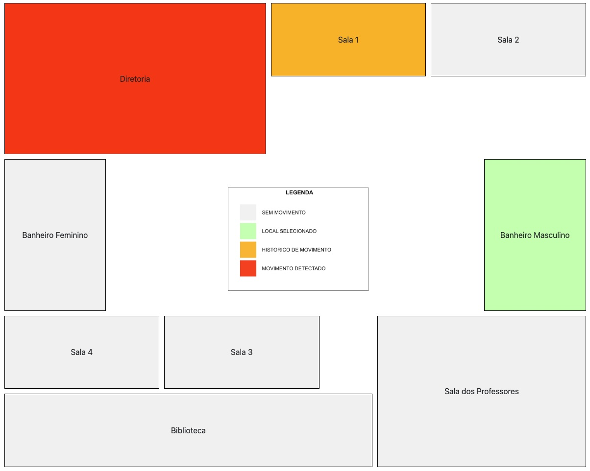

# segCam
PI VI UNIVESP

> O sistema segCam foi concebido com o prpósito de ajudar entidades escolares no sentido de monitoração de câmeras e ambientes sensorizados, para que saibam que sala houve o acionamento de algum sensor de emergência, bem como se existe algum sensor que esteja acionado, demonstrando que o possível invasor encontra-se naquela sala, onde é possível acionar a câmera local para que identifique se de fato é um intruso, possibilitando o acionamento da polícia para demais procedimentos.



### 1 - Teste online

[Página do segCam](https://tonmarcondes.github.io/segCam/)

### 2 - Para rodar localmente

1. Baixe e instale o [Git](https://git-scm.com/downloads) em seu computador
1. Clone o repositório

```bash
git clone https://github.com/tonmarcondes/segCam.git
```

```bash
cd segCam
```

3. Abra o arquivo `index.html` que está na pasta **segCam**

### 3 - Integrantes

- Carlos Alberto Prevato Júnior, 2015284
- Eduardo Vicente Duarte Nunes, 2010716
- Flávio Anjos Rocha
- Hermogenio Martins de Souza, 1800811
- Ismael Swartele Rodrigues, 1822742
- Luiz Gustavo Ribeiro, 2006126
- Patrick, Da Silva Américo; 2015736
- Wellyngton Marcondes; 2014425

### 4 - Para contribuir

Acesse a página do repositótio https://github.com/tonmarcondes/segCam, faça um fork, gere suas atualizações e realize um PR (Pull Request)
